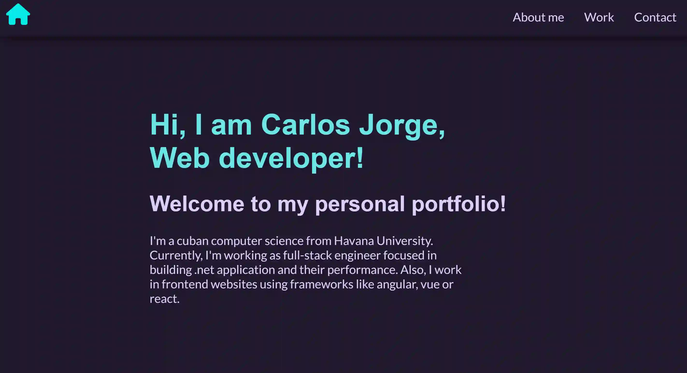
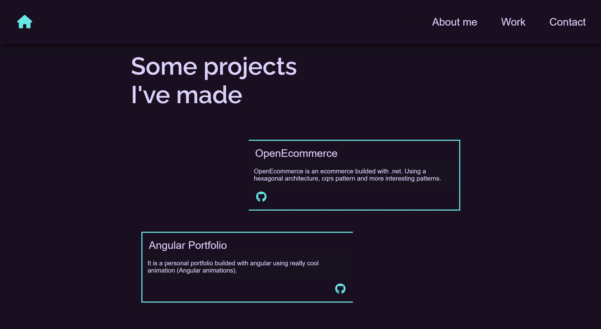
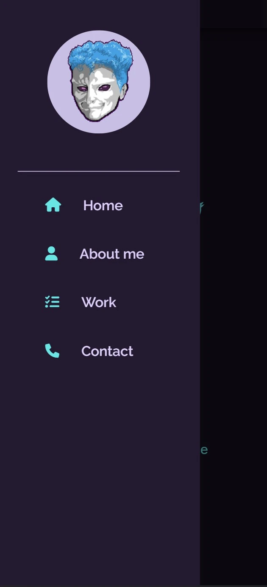
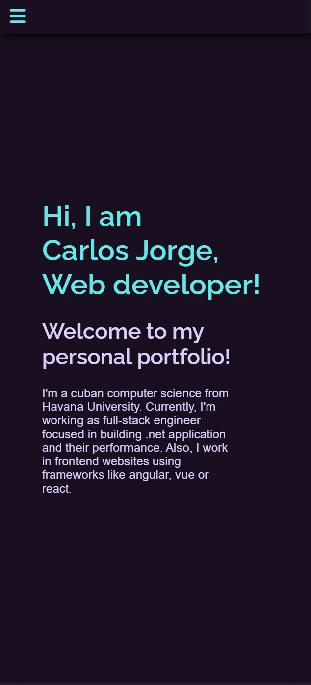

# carlosjorger.github.io

A personal full responsive website porfolio deploy in [github page](https://carlosjorger.github.io/) made in Astro and using tailwindcss.

## Demo

## Mobile Demo

|                              |                              |                              |
| :--------------------------: | :--------------------------: | :--------------------------: |
|  |  |  |

## Why?

This proyect is made with the objetive of showing my work and skills as a software developer.

## Tools

- Astro
- HTML
- CSS
- Tailwind
- Prettierrc
- Typescript

## 🧞 Commands

All commands are run from the root of the project, from a terminal:

| Command                | Action                                           |
| :--------------------- | :----------------------------------------------- |
| `npm install`          | Installs dependencies                            |
| `npm run dev`          | Starts local dev server at `localhost:3000`      |
| `npm run build`        | Build your production site to `./dist/`          |
| `npm run preview`      | Preview your build locally, before deploying     |
| `npm run astro ...`    | Run CLI commands like `astro add`, `astro check` |
| `npm run astro --help` | Get help using the Astro CLI                     |
