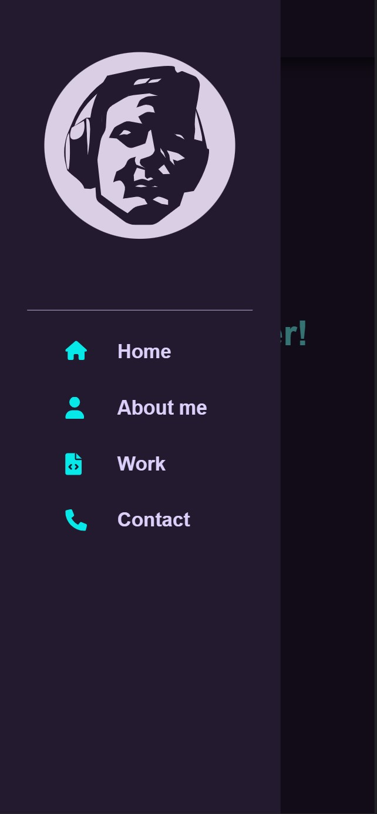
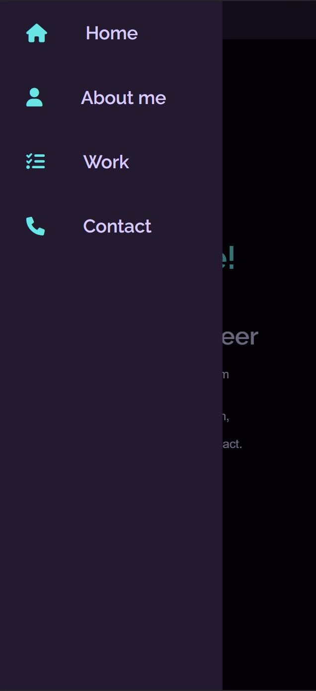

# carlosjorger.github.io

A portfolio website deploy in [github page](https://carlosjorger.github.io/) made only with html, css and js.

## Demo

## Mobile Demo

|                             |                             |
| :-------------------------: | :-------------------------: |
|  |  |

## Why?

This proyect is made with the objetive of learning the basis of frontend development (html/css/js).

## Tools:

- CSS animations and transitions.
- media querys for made the project responsive.
- flexbox and grid.

## How to run this project?

It easy, open the index.html file in a browse and it's done 👍.
